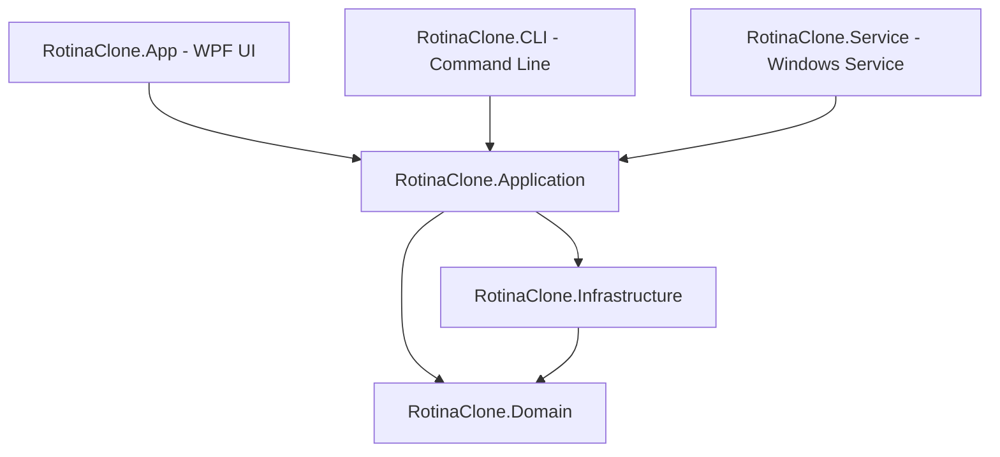

# 🛡️ Rotina Clone Enterprise Edition

[](https://dotnet.microsoft.com/download/dotnet/8.0)
[](https://microsoft.com/windows)
[](https://github.com/dotnet/wpf)
[](https://jrsoftware.org/isinfo.php)

**Rotina Clone Enterprise Edition** is a professional-grade disk cloning, backup orchestration, and disaster recovery suite designed for Windows. It provides robust tools to replicate drives, manage scheduled backups, run lightweight background tasks, and construct bootable recovery media (WinPE).

---

## 🚀 Key Features

*   **💿 Dual-Mode Disk Cloning Engine**
    *   *Intelligent Clone*: Copies only utilized sectors, optimizing speed and supporting destination drive partition resizing.
    *   *Sector-by-Sector Clone*: Creates an exact, forensic block-by-block replica of the source drive, including unallocated space.
*   **📂 Comprehensive Backup Orchestrator**
    *   Configure and schedule full/incremental backups for files and directories.
    *   Set custom execution schedules (Daily, Weekly, Monthly, or Manual).
*   **🔌 WinPE Disaster Recovery Creator**
    *   Generates custom, bootable WinPE USB recovery drives.
    *   Includes automatic physical USB detection (supporting both Fixed and Removable USB external drives).
*   **⚙️ Background Windows Automation Service**
    *   A robust background C# Windows Service that automatically schedules and executes backups.
    *   Hosts a local status REST API endpoint (`http://localhost:9091/`) to query service status.
*   **💻 Command Line Interface (CLI)**
    *   Fully functional CLI utility (`rotinaclone-cli.exe`) for automation, scripting, and integration into existing enterprise schedulers.
*   **🎨 Premium Fluent WPF Interface**
    *   Interactive dashboard showing real-time disk health and system statistics.
    *   Glassmorphic style cards, smooth micro-animations, and dynamic runtime theme switching (Light / Dark mode).

---

## 🛠️ Architecture

The solution uses a clean, modular architecture decoupled into independent layers:



*   **`RotinaClone.Domain`**: Core entities, data transfer objects, settings models, and cloning options.
*   **`RotinaClone.Infrastructure`**: Low-level interfaces for WMI Windows Physical Disks query, JSON Settings Repository, and platform-specific services.
*   **`RotinaClone.Application`**: Implements business rules, backup compressors, scheduling logic, and cloning engines (`SectorCloner` and `IntelligentCloner`).
*   **`RotinaClone.App`**: Desktop UI application utilizing WPF, XAML, MVVM pattern, and dynamic skin styles.
*   **`RotinaClone.CLI`**: Command-line application exposing cloning and backup operations.
*   **`RotinaClone.Service`**: Long-running background worker hosting HTTP listener API.

---

## 💻 Command Line Interface (CLI)

The CLI tool allows system administrators to script backups and cloning operations.

### Usage
```bash
rotinaclone-cli.exe <comando> [opções]
```

### Commands

| Command | Description |
| :--- | :--- |
| `list` | Lists all detected physical hard drives, partitions, and filesystems. |
| `clone` | Initiates a disk cloning operation (requires options below). |
| `run-job <id>` | Runs a specific backup job by its database ID. |

### Options for `clone`

*   `--source <index>`: Index of the physical source disk (e.g. `0`).
*   `--target <index>`: Index of the physical destination disk (e.g. `1`).
*   `--intelligent`: Use Intelligent Copy (copies data sectors only, default).
*   `--sector`: Use Sector-by-Sector Copy (copies every physical block).
*   `--execute`: Disables simulation mode and executes real disk partition overwriting. *(By default, clone runs as a safe simulation).*

*Example command:*
```bash
# Clone physical disk 0 to disk 1 in Sector-by-Sector mode for real (non-simulation)
rotinaclone-cli.exe clone --source 0 --target 1 --sector --execute
```

---

## ⚙️ Background Windows Service

The background service (`RotinaClone.Service.exe`) manages scheduled backups without requiring the user interface to be active.

*   **Polling Loop**: Scans active schedules every 60 seconds and triggers pending backups.
*   **REST API endpoint**: Exposes an HTTP service state listener.
    *   **Endpoint**: `GET http://localhost:9091/`
    *   **Response**: 
        ```json
        {
          "status": "Running",
          "service": "Rotina Clone Enterprise Service",
          "version": "1.0.0"
        }
        ```

---

## 📦 Build & Development

You can build and package the entire suite of applications using the provided PowerShell build script:

```powershell
# Run the automated build script
.\build.ps1
```

The script automatically executes the following pipeline:
1.  **Nuget Restore**: Restores NuGet dependencies for `win-x64` target runtime.
2.  **Compilation**: Builds the solution (`RotinaClone.sln`) in `Release` configuration.
3.  **Testing**: Runs the automated unit testing suite (`RotinaClone.Tests`).
4.  **Publish Portable Packages**: Generates standalone, single-file self-contained executables (bundling .NET 8 framework files within the EXE) and outputs them to a timestamped folder: `.\publish_portable_YYYYMMDD_HHMMSS`.
5.  **Compile Installer**: Detects local Inno Setup installations (`ISCC.exe`) and packages the portable folder into a single setup installer executable: `.\publish_release\rotina_clone_setup.exe`.

---

## 📥 Installation & Setup

### Option 1: Using the Installer (Recommended)
1. Run the compilation pipeline to generate the installer (or grab a release build).
2. Execute `rotina_clone_setup.exe` located in the `publish_release` folder.
3. Choose the setup language (Portuguese / English) and installation directory.
4. (Optional) Check the box to create a Desktop Shortcut.
5. Launch **Rotina Clone** directly from the installer completion screen or the Start Menu.

### Option 2: Portable Deployment
1. Navigate to the generated `publish_portable_*` directory.
2. Run the main UI executable directly: `RotinaClone.App.exe`.
3. To run scheduled tasks in the background, you can register `RotinaClone.Service.exe` as a Windows Service:
   ```cmd
   sc.exe create "RotinaCloneService" binPath= "C:\path\to\RotinaClone.Service.exe" start= auto
   sc.exe start "RotinaCloneService"
   ```

---

## 🎨 User Interface Themes

The WPF application supports dynamic skins. Theme settings are saved persistently and updated dynamically across all open windows.

*   **Dark Mode**: Sleek dark color scheme with glowing borders and semi-transparent glassmorphic panels.
*   **Light Mode**: Clean, bright layout utilizing soft grays, high-contrast text, and optimized accent colors for workspace visibility.
